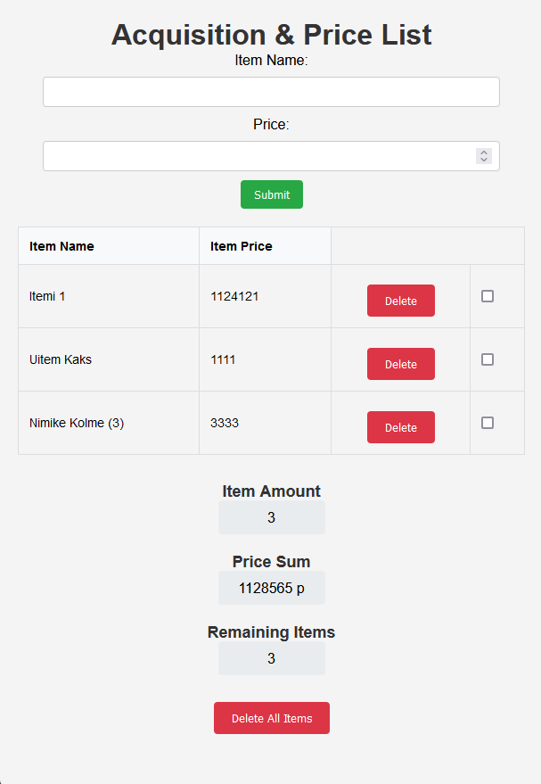

# Acquisition & Price List
Title as above

## Demo link:
Access the app [here](https://animated-cocada-9b6beb.netlify.app/)

## How was the workload divided
I bore everything on my shoulders.

## Table of Content:

- [About The App](#about-the-app)
- [Screenshots](#screenshots)
- [Technologies](#technologies)
- [Setup](#setup)
- [Approach](#approach)
- [Status](#status)
- [Credits](#credits)
- [License](#license)

## About The App
Acquisiton & Price List is a simple app and project

## Screenshots
Add here atleast one screenshot of the working application 

## Technologies
I used the following technologies
- HTML for webpage and divs and so on
- CSS for a responsive and somewhat presentable appearance
- JavaScript for the app's functionality

## Setup
Write brief instructions on how to run and use your app. For example:
- If you wish you can either download the files and run the index locally or use the app via the given link.
- Upon entering the app input a desire item's name.
- Input the price.
- Press Submit.
- You may check off the item if you have acquired it by toggling the checkbox.
- You may also delete the individual item using the "Delete" -button.
- You may also delete all items at once using the "Delte All Items" -button. It will also delete your LocalStorage, meaning data will not stored across sessions.

## Status
Acquisition & Price List is... "finished" for the most part, although I may still return to it to finetune and refine certain aspects when I can and have the time. 
Those aspects being things such as improving the CSS and seeing if I can make the code less "spaghetti" in apperance.

## Credits
For this project I used the following sources.
- [W3Schools](w3schools.com)
- [StackOverflow](stackoverflow.com)
- [Brocode](https://www.youtube.com/@BroCodez)
- Past workshops
- ChatGPT to acquiant myself with new technologies and methods (i.e. JSON and localStorage).
- CoPilot to find Typos. Most of the project was done with auto-completion/suggestions disabled to encourage personal engagement and problem-solving, however, at the later stages of the project when all the functionalities had been implemented and proven working I came to the conclusion that turning it on would help with documentation.

## License
Choose a license for your project by following this [guide](https://docs.github.com/en/communities/setting-up-your-project-for-healthy-contributions/adding-a-license-to-a-repository).

Example: MIT license @ [author](author.com)
